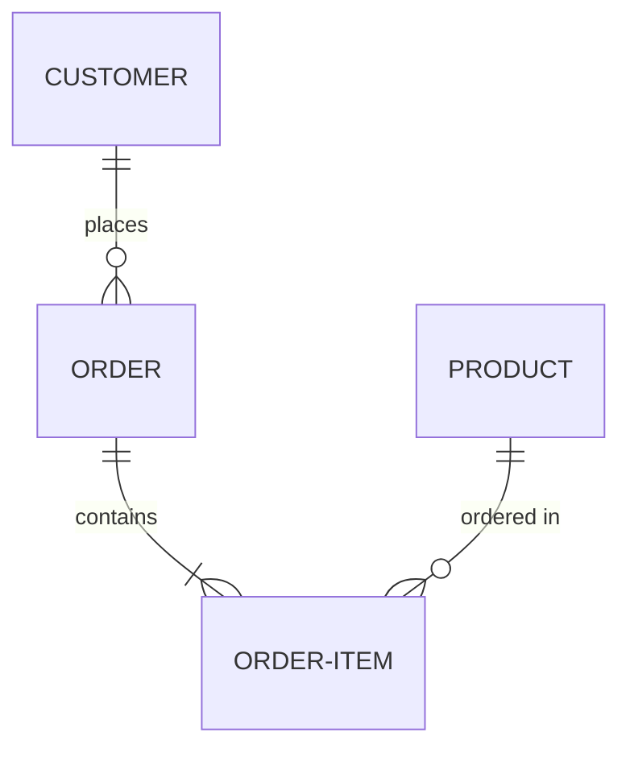
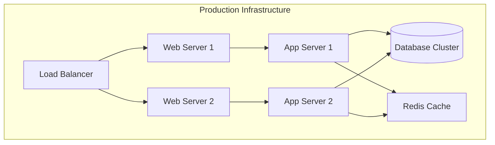

# Section-Specific Documentation Guidelines

This reference provides detailed guidance for each type of documentation section.

## General Documentation

**Purpose:** Ensure good structure and coherence across all files

**Requirements:**
- Technical overview and object model diagrams must be clear at a glance
- Start with architecture or object model overview
- Maintain coherence between different views
- Use standard English
- Include glossary for terms and acronyms
- Stay objective – document facts, not opinions

## Functional Description

**Purpose:** Describe the system from an end-user perspective

**Focus:** WHAT the system does, not HOW it works internally

**Must Include:**

### Overview
- Brief summary of system purpose
- Scope definition
- Key capabilities

### Use Cases and Scenarios
- Step-by-step user interaction flows
- User goals and motivations
- Expected outcomes

### User Interfaces
Document for each UI:
- **Objectives:** What the UI helps users accomplish
- **Data elements:** Input fields, displays, controls
- **Navigation flow:** How users move through the interface
- **Security considerations:** Access controls, data protection
- **Mockups/wireframes:** Links to visual designs
- **Back-end integration:** APIs or services called

### Business Processes
For each process:
- **Steps:** Sequential workflow
- **Inputs:** What data enters the process
- **Triggers:** What initiates the process
- **Data flow:** How information moves through the system

### Out-of-Scope
- Clearly state what is NOT included
- Provide rationale for exclusions

**Approach:** Think like an end user; use concepts, principles, and concrete examples

## Technical Overview

**Purpose:** Provide comprehensive architectural documentation

**Must Include:**

### Layers
Document each layer:
- User Interface Layer
- Business Logic Layer
- Data Access Layer
- Communication/Integration Layer

For each layer, specify:
- Responsibilities
- Technologies used
- Interaction patterns

### Core Components

For each component:
- **Scope and responsibilities:** What it does
- **Public interfaces:** APIs, contracts
- **Dependencies:** What it relies on
- **Configuration:** How it's configured

### Relationships

Document:
- **Interrelationships:** How components connect
- **Dependencies:** What depends on what
- **Data exchange patterns:** Synchronous vs asynchronous
- **Communication protocols:** REST, message queues, etc.

### Design Patterns

For each pattern used:
- **Pattern name:** Repository, Factory, Observer, etc.
- **Purpose:** Why this pattern is used
- **Justification:** Benefits it provides
- **Operation:** How it works
- **Structure:** Components and relationships
- **Implementation notes:** Code conventions

### Component Decomposition

Where applicable:
- Break down complex components
- Show internal structure
- Explain subcomponent responsibilities

### Design Decisions

Document key architectural choices:
- **Decision:** What was decided
- **Rationale:** Why this approach was chosen
- **Considerations:** What factors influenced the decision
  - Scalability requirements
  - Portability needs
  - Technical constraints
  - Team expertise
- **Trade-offs:** What was gained and what was sacrificed
- **Alternatives considered:** What else was evaluated

## Security

**Purpose:** Document security architecture and implementation

**Must Include:**

### Authentication

- **Authentication methods:** Username/password, OAuth, SAML, biometrics
- **Rules and requirements:**
  - Password complexity
  - Multi-factor authentication
  - Session timeout
- **Setup and configuration:**
  - Identity provider configuration
  - Integration steps
  - Environment-specific settings

### Authorization

- **Permission model:** RBAC, ABAC, or other
- **Roles and permissions:**
  - Role definitions
  - Permission assignments
  - Hierarchies
- **Access control rules:**
  - Who can access what
  - Conditional access
- **Coverage scope:**
  - UI access control
  - API authorization
  - Data-level security

### Encryption

- **Data at rest:**
  - Database encryption
  - File storage encryption
  - Encryption keys management
- **Data in transit:**
  - TLS/SSL configuration
  - Certificate management
  - Cipher suites
- **Encryption standards:**
  - Algorithms used
  - Key lengths
  - Compliance requirements

### Security Design Decisions

- **Architectural choices:**
  - Why specific security patterns were chosen
  - Framework selection rationale
- **Security layers:**
  - Defense in depth strategy
  - Multiple protection layers
- **Compliance:**
  - Regulatory requirements (GDPR, HIPAA, etc.)
  - How they're addressed

## Object Model

**Purpose:** Document data structures and relationships

**Must Include:**

### High-Level Description
- Overview of domain model
- Main concepts and entities
- How they relate to business processes

### Entity Relationships
- **Entities:** Main data objects
- **Relationships:** How entities connect
- **Cardinality:** One-to-one, one-to-many, many-to-many
- **Relationship types:** Composition, aggregation, association

### Diagrams
Use entity-relationship diagrams (ERD) or class diagrams:


### Technical Decisions

Document database design choices:
- **Indexes:**
  - Which fields are indexed
  - Why (performance considerations)
- **Triggers:**
  - What triggers exist
  - Purpose and behavior
- **Constraints:**
  - Unique constraints
  - Foreign keys
  - Check constraints
- **Performance considerations:**
  - Denormalization decisions
  - Partitioning strategy
  - Caching approach

## Development Principles

**Purpose:** Guide developers on standards and practices

**Must Include:**

### Prerequisites and Setup
- Required software and versions
- Development environment setup
- Dependencies and how to install them
- Configuration requirements

### Coding Standards
- Naming conventions
- Code formatting rules
- Comment guidelines
- File organization

### Design Patterns
- Patterns used in the project
- When to use each pattern
- Examples from the codebase

### How-To Guides
Practical guides for common tasks:
- Adding a new feature
- Creating a new API endpoint
- Implementing authentication
- Writing tests

### Tips & Tricks
Developer productivity tips:
- Debugging techniques
- IDE configuration
- Useful shortcuts
- Common gotchas and how to avoid them

### Deployment Specifications
- Build process
- Deployment steps
- Environment variables
- Configuration management

### Links and Resources
- External documentation
- Framework guides
- Blog posts
- Community resources

**Approach:** Use practical samples and user stories to illustrate concepts

### Technology Deviations

When documenting new or unusual technology choices:
- **Why chosen:** Justification for the technology
- **How to use:** Getting started guide
- **Common pitfalls:** What to watch out for
- **Best practices:** Recommended patterns
- **Examples:** Working code samples

## Component Description

**Purpose:** Detailed documentation for each system component

**For Each Component Document:**

### Objective/Goal
- What problem does this component solve?
- What business capability does it enable?
- Why does it exist?

### Business Object Model
- Domain entities the component manages
- Business rules it enforces
- Workflows it implements

### Data Schema
- Database tables/collections used
- Schema definitions
- Links to detailed schema documentation
- Views and stored procedures

### Technical Flows

#### Internal Communication
- How subcomponents interact
- Internal messaging patterns
- State management

#### External Integrations
- Third-party systems integrated with
- Integration patterns (REST, gRPC, message queue)
- Error handling and retry logic
- Circuit breakers and fallbacks

### User Interfaces
- UI components provided by this component
- Screens and their purposes
- User workflows supported

### APIs
- Public interfaces and contracts
- Request/response formats
- Authentication and authorization
- Rate limiting
- Versioning strategy
- Example requests and responses

### Messaging
- Events published by the component
- Events subscribed to
- Message formats
- Messaging infrastructure used

## Test Documentation

**Purpose:** Document testing strategy and test cases

**Must Include:**

### Test Strategy

For each test level, document:

#### Unit Tests
- **Scope:** Individual functions/methods
- **Coverage goals:** Target percentage
- **Automation:** Framework used (xUnit, NUnit, MSTest)
- **Environment:** Local development
- **Timing:** Run on every build
- **Ownership:** Developers

#### Component Tests
- **Scope:** Component interactions
- **Coverage:** Integration points
- **Automation:** Testing framework
- **Environment:** Test environment
- **Timing:** Pre-deployment
- **Ownership:** Development team

#### Functional Tests
- **Scope:** End-to-end user scenarios
- **Coverage:** Critical user paths
- **Automation:** Degree of automation
- **Environment:** QA/staging
- **Timing:** Before release
- **Ownership:** QA team

#### Non-Functional Tests
Types:
- **Performance tests:** Load, stress, endurance
- **Security tests:** Vulnerability scanning, penetration testing
- **Accessibility tests:** WCAG compliance
- **Compatibility tests:** Browser, device, OS

For each:
- **Scope:** What is tested
- **Tools:** Testing tools used
- **Metrics:** Success criteria
- **Environment:** Where tests run
- **Timing:** When tests are executed

#### Business/Acceptance Tests
- **Scope:** Business requirements validation
- **Coverage:** Acceptance criteria
- **Automation:** BDD frameworks (SpecFlow, Cucumber)
- **Ownership:** Product owner + QA

### Manual Test Cases

For each manual test case:

**Test Case Header:**
- Test ID
- Test name
- Priority (Critical, High, Medium, Low)
- Related requirement/user story

**Preconditions:**
- Required setup
- Test data needed
- System state

**Test Steps:**
1. Step 1 - Action to perform
2. Step 2 - Next action
3. Step 3 - Verification step

**Expected Results:**
- What should happen after each step
- Final expected state
- Success criteria

**Test Data:**
- Input values to use
- Test accounts
- Sample files

**Example:**
```
Test ID: TC-001
Name: User Login with Valid Credentials
Priority: Critical

Preconditions:
- User account exists: testuser@example.com / Password123!
- Application is running
- User is logged out

Steps:
1. Navigate to login page
2. Enter username: testuser@example.com
3. Enter password: Password123!
4. Click "Login" button

Expected Results:
1. Login page is displayed with username and password fields
2. Username field shows entered value
3. Password field shows masked characters
4. User is redirected to dashboard
5. Welcome message displays: "Welcome, Test User"
6. Session cookie is set

Test Data:
- Valid username: testuser@example.com
- Valid password: Password123!
```

## Infrastructure & Deployment

**Purpose:** Document deployment architecture and processes

**Must Include:**

### Environments

For each environment:

#### Development
- Purpose
- Access (who can access)
- Configuration
- Refresh/reset policy

#### QA/Testing
- Purpose
- Test data management
- Deployment frequency
- Smoke test procedures

#### Training
- Purpose
- Data refresh schedule
- Access controls
- Version alignment

#### Acceptance/Staging
- Purpose
- Production parity level
- Deployment process
- Validation procedures

#### Production
- Purpose
- Change management process
- Deployment windows
- Rollback procedures
- Monitoring and alerting

### Deployment Process

#### Steps
1. Pre-deployment checklist
2. Build process
3. Package creation
4. Deployment execution
5. Post-deployment validation
6. Smoke tests

#### Automation
- CI/CD pipeline description
- Build triggers
- Automated tests
- Deployment gates
- Approval workflows

#### Rollback Procedures
- When to rollback
- How to rollback
- Validation after rollback
- Communication protocol

### Architecture Mapping

**Logical to Physical Mapping:**
- How logical components map to infrastructure
- Server/container allocation
- Load balancing setup
- Data storage mapping
- Cache locations

**Diagram Example:**


### Communication

#### Protocols
- HTTP/HTTPS configuration
- WebSocket connections
- gRPC endpoints
- Message queue protocols

#### External Communications
- Third-party API integrations
- External service endpoints
- Authentication for external services
- Network security (firewalls, IP whitelisting)

#### Network Topology
- Network zones (DMZ, internal, database)
- Firewall rules
- VPN requirements
- Network segmentation

### Configuration

#### Devices and Hardware
- Server specifications
- Storage requirements
- Network equipment
- Security appliances

#### Configuration Data Management
- Configuration files location
- Environment-specific settings
- Secrets management (keys, certificates)
- Configuration versioning

### Platform-Specific Details

#### .NET Deployment
- **Branching strategy:** GitFlow, trunk-based
- **Versioning:** Semantic versioning
- **Release pipelines:**
  - Build steps
  - Test gates
  - Deployment stages
- **Policies:**
  - Code review requirements
  - Branch protection
  - Merge policies

#### Angular Deployment
- **Build process:**
  - Development build
  - Production build optimization
  - Environment configuration
- **Deployment pipelines:**
  - Asset compilation
  - CDN upload
  - Cache invalidation
- **Environment files:** Configuration per environment

## Support, Tips & Tricks

**Purpose:** Provide troubleshooting knowledge and productivity tips

**Must Include:**

### Development Issues

Common problems and solutions:

**Problem:** Build fails with dependency error
**Solution:** 
1. Clear package cache
2. Restore packages
3. Rebuild solution

**Problem:** Database connection fails in development
**Solution:**
- Check connection string
- Verify database container is running
- Check firewall settings

### Environment Setup

#### Configuration Gotchas
- Common misconfigurations
- Environment-specific settings that trip people up
- Order of operations that matters

#### Setup Shortcuts
- Scripts to automate setup
- Recommended IDE extensions
- Useful development tools

### FAQ

**Q: How do I reset my local database?**
A: Run the script `scripts/reset-db.ps1`

**Q: What ports need to be open for development?**
A: 
- 5000: API
- 4200: Angular dev server
- 6379: Redis
- 5432: PostgreSQL

**Q: How do I debug async issues?**
A: Enable async debugging in Visual Studio: Tools > Options > Debugging > General > Enable Async Call Stack

### Important Notes

- **Do not duplicate standards:** Link to existing standards documentation instead
- **Link to other docs:** For architecture and functional details, reference the appropriate documentation files
- **Separate knowledge base:** Document incidents and resolutions in a separate knowledge base system
- **Focus on practical info:** Provide actionable, useful information that developers can immediately apply

### Format

Use a clear, scannable format:

```markdown
## Issue: Cannot Connect to API in Development

**Symptoms:**
- HTTP 500 errors
- Connection refused messages
- API not responding

**Diagnosis:**
1. Check if API is running: `ps aux | grep api`
2. Verify port: `netstat -an | grep 5000`
3. Check logs: `tail -f logs/api.log`

**Solutions:**

### Solution 1: Restart API
```bash
npm run api:restart
```

### Solution 2: Clear Configuration Cache
```bash
rm -rf .config/cache
npm run api:start
```

**Related:**
- [API Configuration](../technical/api-configuration.technical.md)
- [Troubleshooting Guide](troubleshooting.technical.md)
```

---

Use these guidelines when creating documentation for each section type. Remember to adapt to your specific project context while maintaining consistency and clarity.
